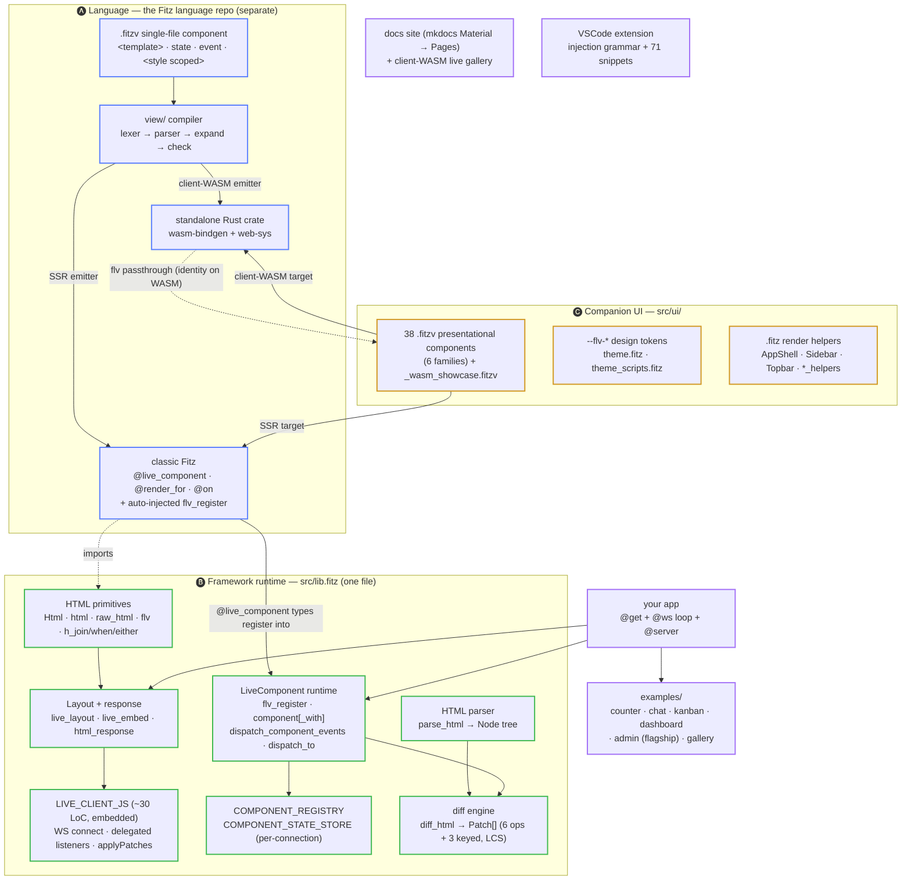
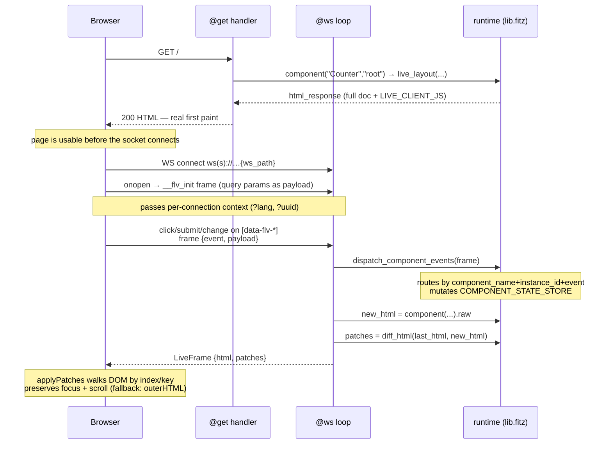

# Architecture

This document is the map of **how fitz-liveviews works as a whole** — the
framework runtime, the companion UI library, the two ways a `.fitzv`
single-file component compiles, and the wire protocol that keeps a browser
in sync with the server. It is the reference for understanding the framework
from the inside; to *use* it, start with the [Guide](liveviews.md) or the
[Course](course/index.md).

fitz-liveviews sits **on top of the Fitz language**. The language ships the
`.fitzv` compiler (Phase 11) and the HTTP/WebSocket runtime; this framework is
the runtime library + component kit that turns those primitives into a
real-time, server-rendered UI stack. For the compiler internals — lexer,
checker, the `view/` emitters — see the language's own
[architecture doc](https://thegreekman76.github.io/fitz/architecture/).

> **Status**: covers up to **v0.25.0** (companion UI kit closed through the
> Admin-ABM extraction; client-WASM gallery CW.1–CW.8). Living doc — refreshed
> alongside the runtime.

---

## The whole framework in one picture

Three layers stacked on the language, plus the tooling around them:



ASCII fallback (same picture, no colors — for terminals and editors that do
not render mermaid):

```text
[A] LANGUAGE (Fitz language repo, separate) -- the .fitzv compiler
+----------------------------------------------------------------+
| Foo.fitzv  -->  view/ (lexer -> parser -> expand -> check)     |
|      |                                                         |
|      +--> SSR emitter -> classic Fitz:                         |
|      |      @live_component / @render_for / @on                |
|      |      + auto-injected flv_register                       |
|      +--> client-WASM emitter -> standalone Rust crate         |
|             (wasm-bindgen + web-sys)                           |
+----------------------------------------------------------------+
         | registers into              | (offline widgets)
         v                             v
[B] FRAMEWORK RUNTIME -- src/lib.fitz (ONE file)
+----------------------------------------------------------------+
| HTML primitives: Html . html . raw_html . flv . h_join/...     |
|      |                                                         |
|      v                                                         |
| live_layout / live_embed / html_response --> LIVE_CLIENT_JS    |
|      (full doc + embedded ~30 LoC browser runtime)             |
|                                                                |
| LiveComponent runtime:                                         |
|   flv_register . component[_with]                              |
|   . dispatch_component_events . dispatch_to                    |
|   -- keyed by "name:instance_id" -->                           |
|   COMPONENT_REGISTRY + COMPONENT_STATE_STORE (per conn)        |
|                                                                |
| parse_html --> Node tree --> diff_html --> Patch[]             |
|      (6 ops + 3 keyed, LCS matching)                           |
+----------------------------------------------------------------+
         ^ imports                     ^ dual-target source
         |                             |
[C] COMPANION UI -- src/ui/
+----------------------------------------------------------------+
| 38 .fitzv presentational components (6 families)               |
|   + _wasm_showcase.fitzv (dual-target proof)                   |
|   + --flv-* theme tokens (theme.fitz)                          |
|   + .fitz render helpers (AppShell/Sidebar/Topbar/*_helpers)   |
+----------------------------------------------------------------+

your app: @get + @ws loop + @server  -->  layout + LiveComponents
around it: examples/ . docs site (mkdocs->Pages) . VSCode ext
```

---

## The request lifecycle

A LiveView is **server-rendered first, then live**. There is no client bundle
to hydrate — the first HTML paint is real, SEO-friendly HTML, and a small
embedded script opens a WebSocket that takes over updates by applying diffs
in place.



ASCII fallback:

```text
Browser                     Server (@get / @ws + lib.fitz)
  |  GET /                  |
  |------------------------>| component(...) -> live_layout(...)
  |<------------------------| html_response: full HTML + LIVE_CLIENT_JS
  |  (real first paint)     |
  |                         |
  |  WS connect             |
  |------------------------>|
  |  onopen: __flv_init     | (query params -> payload: ?lang, ?uuid)
  |------------------------>|
  |                         |
  |  [data-flv-*] event     |
  |  {event, payload}       |
  |------------------------>| dispatch_component_events(frame)
  |                         |   -> mutate COMPONENT_STATE_STORE
  |                         | new_html = component(...).raw
  |                         | patches  = diff_html(last, new_html)
  |<------------------------| LiveFrame {html, patches}
  |  applyPatches(root, ...)|
  |  (index/key walk;       |
  |   fallback outerHTML)   |
```

**Where the pieces live** (all in `src/lib.fitz`):

- **First paint** — `live_layout(ws_path, root_id, initial)` wraps the initial
  `Html` in a full `<!doctype html>` document with a `<meta viewport>` and an
  injected `<script>` carrying `data-flv-ws` / `data-flv-root` + the entire
  `LIVE_CLIENT_JS`. `live_embed(...)` is the fragment-only variant (drop into
  an existing shell; only `#root_id` gets patched). `html_response(h)` sets
  `Content-Type: text/html`.
- **The browser runtime** — `LIVE_CLIENT_JS` is the whole client, ~30 lines of
  JavaScript stored as an escaped string constant. It connects the WebSocket,
  sends `__flv_init` with the ws_path query params on `onopen` (the mechanism
  to pass per-connection context, since the `@ws` handler can't read the
  handshake query), delegates three body listeners (`click` → `data-flv-click`,
  `submit` → `data-flv-submit`, `change` → `data-flv-change` sets
  `payload["value"]`), builds each payload from `data-flv-value-*` attributes +
  `serializeForm` + `enrichWithComponentContext` (walking up to the
  `[data-flv-component-name]` wrapper), and runs `applyPatches` (a keyed DOM
  walker) with `outerHTML` as the fallback.
- **The `@ws` loop is yours** — the framework provides the envelope + dispatch
  + diff; your app writes the `@ws(ws_path) async fn(ws: WsConn<LiveFrame>)`
  loop that does `frame = ws.recv()?`, `dispatch_component_events(frame)`,
  re-render, `diff_html`, `ws.send(...)` (or `ws.broadcast(...)` for
  multi-user). There is no separate WS-connection module — that lifecycle is
  the Fitz language's HTTP/WS runtime.

---

## The three rendering modes (and where hydration fits)

fitz-liveviews and the `.fitzv` compiler give you **three** ways to render — do
not confuse them:

| Mode | Where state lives | Network per interaction | Offline | Multi-user | Best for |
|---|---|---|---|---|---|
| **SSR + WS takeover** (the framework) | Server (`COMPONENT_STATE_STORE`) | one round trip | no | yes | data-backed screens, dashboards, CRUD, chat |
| **client-WASM** (language target) | Browser (`RefCell` cells) | none | yes | no | offline widgets, embeddable interactive bits |
| **SSR hydration** (language target, Phase 11.12) | Browser, adopting the server-painted DOM | none after boot | yes | no | eliminating the boot flash for composing WASM components |

**The framework's model is "SSR first paint → WS takeover", not
adopt/hydrate.** When the socket connects, the live render simply takes over —
there is no blank-screen-then-hydrate step, and no server-painted DOM that the
client adopts. SSR/hydration à la Nuxt/Next is an **explicit non-goal** of the
framework runtime.

**SSR hydration (Phase 11.12) is a language-repo feature of the client-WASM
target**, not of fitz-liveviews. There, the compiler emits a server-painted
HTML contract (with `<!--fr-->`/`<!--fi-->` comment markers + a
`<script id="__flv_state_*">`) and the WASM crate *adopts* that DOM at boot
instead of rebuilding it — preserving live inputs and killing the flash. That
lives in the language repo's `src/view/codegen_wasm.rs`; this framework's runtime never
paints those markers (its own HTML parser doesn't even allow comments inside
the LiveView root). If you compile a companion component with
`fitz build --target wasm-client`, hydration is a language concern; if you use
it SSR, the WS-takeover model applies.

---

## Module map

### 🅑 The runtime — `src/lib.fitz` (the entire framework)

One file, read top to bottom as a pipeline. The regions:

- **HTML primitives (Phase 1)** — `type Html { raw: Str }`, `html(raw)`,
  `raw_html(s)`, `flv(s)` (HTML-escape), `h_join`, `h_when`, `h_either`. `Html`
  is an opaque wrapper so the type system distinguishes "safe HTML" from a raw
  `Str`; `flv` is the escape you reach for on user data, `raw_html` the escape
  hatch when you know the string is safe.
- **LiveFrame + embedded client (Phase 2/3b)** — `type LiveFrame { event,
  payload: Map<Str,Str>, html, patches: List<Patch> }` is the wire envelope
  in both directions. `LIVE_CLIENT_JS` is the browser runtime as an escaped
  string constant.
- **Layout / response** — `live_layout`, `live_embed`, `html_response`
  (covered above).
- **HTML parser (Phase 3b)** — `parse_html(input) -> List<Node>` with
  `type Node { kind, tag, attrs, children, text }` + helper structs. Turns a
  rendered HTML string into a Node tree so the diff engine can compare two
  renders. Deliberately restricted (no comments, no `<script>` inside the
  LiveView root) — that restriction is *why* the hydration comment-marker
  contract can't live here.
- **Diff engine (Phase 3b + keyed 3c)** — `type Patch { op, path, content,
  name }` and `diff_html(old, new) -> List<Patch>`. Six patch ops (`text`,
  `replace`, `append`, `remove`, `set_attr`, `remove_attr`) plus three keyed
  ops (`insert_keyed`, `move_keyed`, `remove_keyed`) driven by an LCS over
  `data-flv-key` values — so reordering a grid collapses from N replacements to
  a handful of moves (keyed diffing, v0.16.0).
- **LiveComponent runtime (Phase 4)** — the per-instance state model:
    - `type ComponentReg { render_fn, event_handlers, initial_state }`.
    - `COMPONENT_REGISTRY` — populated at boot by `flv_register(name,
      initial_state, render_fn, event_handlers)`.
    - `COMPONENT_STATE_STORE` — keyed `"{name}:{instance_id}"` (per connection).
    - `component(name, id)` — seeds the store from `initial_state` on first
      render, wraps the inner HTML in
      `<div data-flv-component-name data-flv-value-instance_id>`.
    - `component_with(name, id, initial)` — per-connection seed (first render
      uses `initial`); this powers the Admin-ABM uuid-per-socket +
      connection-scoped locale pattern.
    - `dispatch_component_events(frame)` — routes a frame by
      `component_name` + `instance_id` + `event` to the matching `@on` handler,
      auto-seeds cold state, mutates the store.
    - `dispatch_to(name, id, event, payload)` — server-initiated child→parent
      dispatch. `component_state` / `set_component_state` — direct store access.

### 🅒 The companion UI — `src/ui/`

**38 `.fitzv` presentational components** (importable by dotted sub-path
`fitz_liveviews.ui.<Name>`), plus `_wasm_showcase.fitzv` (a dual-target wrapper
that composes 15 real components to prove one source compiles both ways) = 39
`.fitzv` total. Each is a `component name { state{props} <template> <style
scoped> }` SFC; most `from fitz_liveviews import flv`. Grouped by family:

- **Primitives** — `Button` `Card` `Badge` `Alert` `Input` `Spinner` `Icon`
  `Modal` `Pager` `Toast` `ConfirmDialog`
- **Shell** — `Breadcrumbs` `ThemeToggle` (the two-level nav loop + document
  assembly stay as plain `.fitz` render helpers: `AppShell.fitz`,
  `Sidebar.fitz`, `Topbar.fitz`)
- **Dashboard** — `StatCard` `BarChart` `ProgressBar`
- **DataGrid** — `DataGrid` `SortableHeader` `GridToolbar` `GridFilters`
- **Forms — inputs** — `Textarea` `Select` `Checkbox` `CheckboxGroup`
  `RadioGroup` `Rating` `DatePicker`
- **Forms — composite** — `FormLayout` `FormRow` `GroupSelect` `MultiSelect`
  `Tabs` `Stepper` `TreeView`
- **Feedback & misc** — `Chip` `CountBadge` `Tooltip` `Divider`
  `ExpansionPanel`

**Supporting `.fitz` modules** in `src/ui/`: `theme.fitz` (the `--flv-*` design
tokens, light/dark), `theme_scripts.fitz` (anti-FOUC boot + theme cycle),
`shell_types.fitz`, `icon.fitz` (SVG set), and the family helpers
`chart_helpers.fitz` / `grid_helpers.fitz` / `pager_helpers.fitz` /
`form_input_helpers.fitz` / `form_layout_helpers.fitz`. Styling contract: every
component reads `var(--flv-*, <fallback>)`; re-theme by aliasing the tokens to
your palette (the Admin ABM does exactly this). See the
[UI catalog](ui-components.md) for the per-component reference and
[companion UI benefits](companion-ui-benefits.md) for the why.

---

## How it sits on the `.fitzv` compiler

fitz-liveviews is the **first real consumer** of the language's Phase 11
`.fitzv` single-file-component pipeline, which has two emitters:

- **SSR emitter → classic Fitz.** The loader transforms `Counter.fitzv` into
  classic Fitz that emits `@live_component("Counter")` on the state type +
  `@render_for` (`Counter_render`) + one `@on` handler per event. Cross-module
  **auto-inject** (language v0.21.0) synthesizes the
  `flv_register("Counter", Counter{}, Counter_render, {...})` boot call, so your
  `main.fitz` just does `from Counter import Counter, Counter_render,
  Counter_<event>…` and never writes `flv_register` by hand.
- **client-WASM emitter → standalone Rust crate.** `fitz build --target
  wasm-client` compiles the template to real DOM ops (wasm-bindgen + web-sys),
  mounted via `[[bin]] mount="#app"`. The `examples/wasm-gallery/` and
  `src/ui/_wasm_showcase.fitzv` prove companion components run both ways.

**One `.fitzv` source, up to two targets.** What gates dual-targeting is the
WASM *capability envelope*, not the syntax — `flv` is an identity passthrough on
WASM (a text node escapes intrinsically, language CW.6/v0.29.2), so an SSR
component with `{flv(label)}` compiles for WASM unchanged; the raw-HTML helpers
(`html`/`raw_html`/`h_join`/`h_when`/`h_either`) hard-error on WASM because
they inject unescaped markup. See [Client-WASM](client-wasm.md) for the full
envelope, and the language's [architecture doc](https://thegreekman76.github.io/fitz/architecture/#view-fitzv-single-file-components-phase-11)
for the `view/` compiler internals.

---

## Why this shape

- **The runtime is one `.fitz` file.** `src/lib.fitz` holds the whole framework
  — primitives, parser, diff, client JS, component runtime. It's small enough
  to read end to end, and every app depends on exactly one library entry
  (`[lib] entry = "src/lib.fitz"`).
- **Diff over the wire, not a VDOM in the browser.** The server renders HTML
  strings, parses both the old and new render into Node trees, and ships a
  minimal `Patch[]`. The browser applies patches by index/key path, preserving
  focus and scroll — no client-side framework, no build step, no `npm install`.
  The `outerHTML` fallback guarantees correctness when a patch can't apply.
- **Per-connection state.** `COMPONENT_STATE_STORE` is keyed by
  `name:instance_id`; `component_with` + a `?uuid` in the ws_path realize
  per-socket private state (the Admin ABM's connection-scoped pattern). No
  global mutable UI state leaks between users unless you opt into
  `ws.broadcast(...)`.
- **SSR + WASM from one source.** The same `.fitzv` compiles to a server-side
  string builder or an in-browser DOM crate; the framework only participates in
  the SSR half. This is what lets the companion kit be a *presentational*
  library usable in either mode.
- **SSR/hydration à la Next is a non-goal.** The WS-takeover model is the whole
  point — it keeps the runtime tiny and the mental model simple. Client-side
  routing, a full SPA mode, and a React/Vue replacement are non-goals too.

---

## Where things live

| Concern | Location |
|---|---|
| Framework runtime (all of it) | `src/lib.fitz` |
| Companion UI components | `src/ui/*.fitzv` (38 + `_wasm_showcase.fitzv`) |
| Theme tokens + render helpers | `src/ui/theme.fitz`, `src/ui/*_helpers.fitz`, `src/ui/{AppShell,Sidebar,Topbar}.fitz` |
| Example apps | `examples/` (counter, chat, kanban, dashboard, **admin** flagship, gallery, wasm-gallery, course) |
| Docs site source | `docs/` (mkdocs Material → GitHub Pages, also builds the client-WASM live gallery under `/live/`) |
| VSCode extension | `editors/vscode/` (injection grammar + 71 snippets, `.vsix` per release) |
| The `.fitzv` compiler + HTTP/WS runtime | the **[language repo](https://github.com/Thegreekman76/fitz)** (`src/view/`, `src/http.rs`) |

---

*New here? Read the [Course](course/index.md) (guided path) or the
[Guide](liveviews.md) (reference). To see it running, open the
[Live gallery](live-gallery.md) or the [Admin ABM example](examples/admin.md).*
